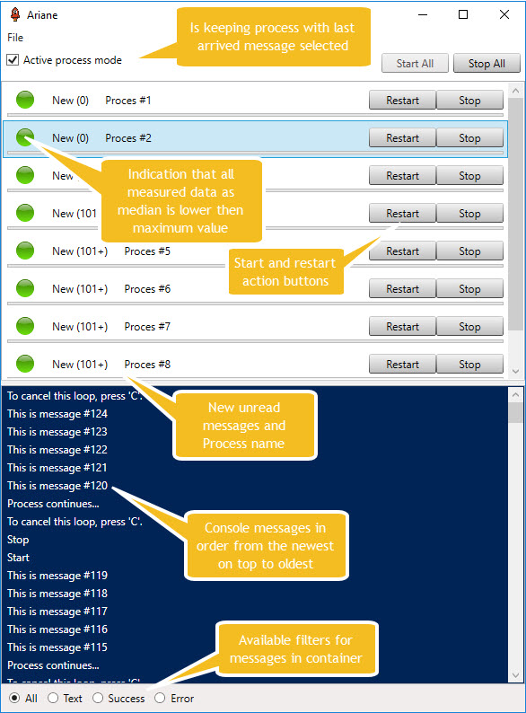
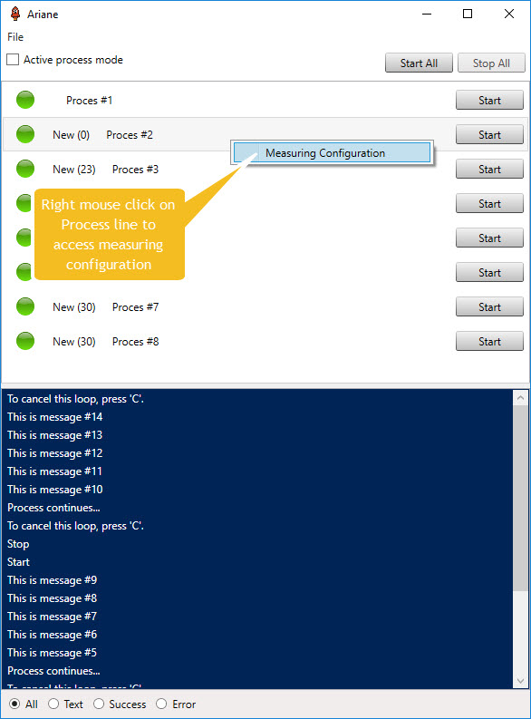
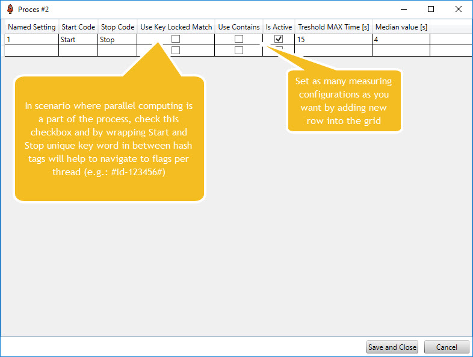
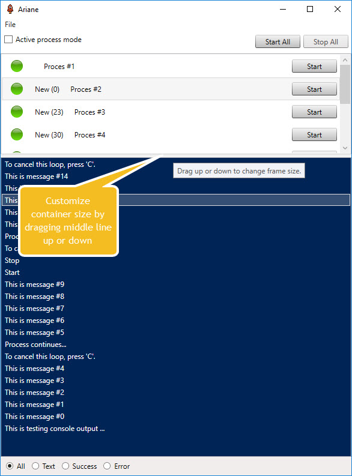
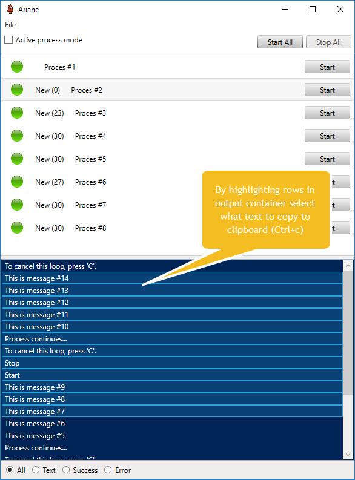
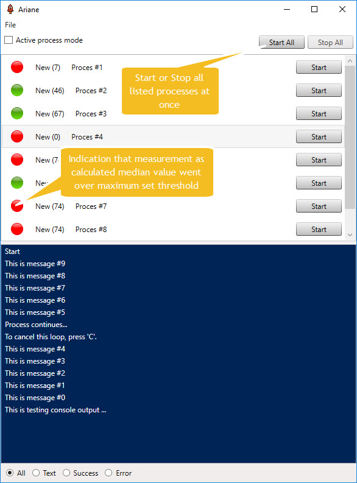

# Ariane

Simple and reliable utility to for process orchestration management and time execution measuring - NOW IN .NET CORE! 
Standalone application written in **WPF** can host multiple processes and display selected console output in centralized window console.
Allows log data filtering based on Error or Success substrings inside the log message.


## What type of problems this project help you to solve?
This approach helps you to keep a track of the latest output data coming from console applications, navigate into Error messages by 
applying filters or copy and paste selected records from the output window container for further context investigation.

Standalone application gets build into one executable file for easy to install and peace of mind purposes, so that all dependent references are on the place during run time.

Also supports consuming messages send via **RabbitMQ exchange**. For more details how to configure pipeline, navigate into RabbitMQ section below. 

Utility listens to Win events for process Start/Stop and for this reason, it needs to have Administrator rights granted before start.

## Quick guide how to interact with user interface














## Does not require installation, just:
1. Build the solution
2. Run the Ariane executable file for first time and after it opens up, close it
3. **Configuration.JSON** file at application root path will be generated
4. Open the file and configure your processes
5. Start Ariane

## Configure process/console list like in example (step 4.)
```json
[
  {
    "DisplayName": "Process #1",
    "ProcessFileName": "TestingConsole.exe",
    "Arguments": null,
    "RootPath": "C:\\Users\\marti\\source\\GitHub\\Ariane\\output\\Debug",
    "LoggingSourceType": "Console",
    "RabbitMQTopicName": null,
    "MeasureSettings": [
      {
        "Name": "1",
        "StartCode": "Start",
        "StopCode": "Stop",
        "IsActive": true,
        "ThresholdMaxTimeInSec": 1,
        "UseContainsEvaluation": false,
        "UseKeyLockedMatch": false
      }
    ]
  },
  {
    "DisplayName": "Process #2",
    "ProcessFileName": "TestingConsole.exe",
    "Arguments": null,
    "RootPath": "C:\\Users\\marti\\source\\GitHub\\Ariane\\output\\Debug",
    "LoggingSourceType": "Console",
    "RabbitMQTopicName": null,
    "MeasureSettings": [
      {
        "Name": "1",
        "StartCode": "Start",
        "StopCode": "Stop",
        "IsActive": true,
        "ThresholdMaxTimeInSec": 15,
        "UseContainsEvaluation": false,
        "UseKeyLockedMatch": false
      }
    ]
  }
]
```
## Application behaviour to be aware of
In very long running use cases and beside the fact that output messages are stored in memory only,
application will **keep 1100** console messages per process and will delete the oldest **100 every time number exceeds**.

## RabbitMQ pipeline configuration
1. Install RabbitMQ if not installed already [RabbitMQ for Windows](https://www.rabbitmq.com/install-windows.html)
2. Build NLog.RabbitMQ.Appender from the solution
3. Install NLog.RabbitMQ.Appender.dll appender from the output to application which will broadcast log messages. 
If using **nLog** use this getting started quick quid how to add the appender to your application:
```c#
  <nlog  xmlns="http://www.nlog-project.org/schemas/NLog.xsd"
      xmlns:xsi="http://www.w3.org/2001/XMLSchema-instance">
    <extensions>
      <add assembly="NLog.RabbitMQ.Appender"/>
    </extensions>
    <targets>
      <target name="rabbit" xsi:type="RabbitMQ" />
    </targets>
    <rules>
      <logger name="*" levels="Debug,Info" writeTo="rabbit" />
    </rules>
  </nlog>
```
4. Add **RabbitMQConnection** to appSettings of **app.config** file as in example below
```c#
  <appSettings>
    <add key="RabbitMQConnection" value="host=localhost;port=5672;virtualHost=/;username=admin;password=admin;requestedHeartbeat=0"/>
  </appSettings>
```
5. Change LoggingSourceType to **RabbitMQ** and what **RabbitMQTopicName** topic routing key you want to use as in example below
```json
[
  {
    "DisplayName": "Process #1",
    "ProcessFileName": "TestingConsole.exe",
    "Arguments": null,
    "RootPath": "C:\\Users\\marti\\source\\GitHub\\Ariane\\output\\Debug",
    "LoggingSourceType": "RabbitMQ",
    "RabbitMQTopicName": "Ariane",
    "MeasureSettings": [
      {
        "Name": "1",
        "StartCode": "Start",
        "StopCode": "Stop",
        "IsActive": true,
        "ThresholdMaxTimeInSec": 1,
        "UseContainsEvaluation": false,
        "UseKeyLockedMatch": false
      }
    ]
  }
]
```
6. Save file and start Ariane
7. Click Connect button once your monitored application is running beside RabbitMQ Hub service
_For more information how to use it, navigate into **NLog.RabbitMQ.Appender.Test** project within the solution_

## Want to contribute with idea?
Please submit pull requests that are based on the develop branch. Sample work Your pull request will take "yourWork" branch in your repo and merge into our develop branch.
Where possible, pull requests should include unit tests that cover as many uses cases as possible (not always relevant). 

Code conventions are based on ReSharper - if you don't have it, follow ones at VS.

Tell me how you like it by giving me a feedback on [your feedback](https://www.martinstanik.com "My personal home page"). Enjoy the application!

## Authors

* **Stanik Martin** - *Initial work* - [Stenly311](https://github.com/stenly311)